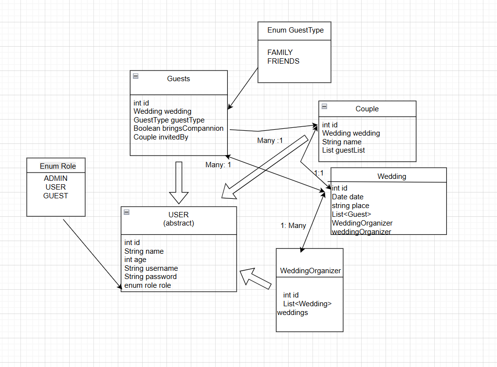

# Wedding Planner Project
    📋 DESCRIPCION DEL PROYECTO 📋

Esta aplicación es un proyecto diseñado para simplificar la planificación y gestión de una boda, tanto para la pareja 
que se casa como para el o la organizador de boda. Tiene funcionalidades para organizar y consultar invitados, gestionar y modificar
detalles del evento o de la pareja, con un sistema de roles de usuario (Admin para Wedding Organizer, Editor para la pareja y Guest
para lxs invitadxs), que les ofrece acceso personalizado.

El proyecto es una aplicación de back end diseñada en Java con Spring Boot, y que proporciona API RESTful para la gsetión de los 
datos y una autenticación de usuarios para proteger información sensible, que se accede mediante tokens JWT.

    📐 DIAGRAMA DE CLASES

    🚀 TECNOLOGIAS Y HERRAMIENTAS 🚀
-Java 17

-Spring Boot 3

-Jpa Hibernate

-JWT Authentication

-Maven : dependencias

-MYSQL : base de datos

-Postman : pruebas

-Git : control de versiones

    🪜 INICIAR LA APLICACION 🪜 

1. Clona el repositorio
2. Importa el proyecto en tu IDE
3. Configura el archivo  "application.properties"

    spring.application.name=weddingplanner
    spring.datasource.url=jdbc:mysql://localhost:3306/wedding_planner
    spring.datasource.username=your-username
    spring.datasource.password=your-password
    spring.datasource.driver-class-name=com.mysql.cj.jdbc.Driver
    spring.jpa.hibernate.ddl-auto=update
    server.error.include-stacktrace=never
    spring.main.allow-circular-references=true
    logging.level.org.springframework.security=DEBUG

4. Ejecuta el proyecto.
5. Haz las pruebas con Postman u otra aplicación.

    
    📁 CONTROLADORES Y RUTAS 📁

-Auth Controller: para iniciar sesión y registrar usuarios según su tipo.

    ("/api/auth")
    POST / ("/register/admin") Registra un usuario ADMIN
    POST / ("/register/editor") Registra un usuario EDITOR
    POST / ("/register/guest") Registra un usuario GUEST
    POST / ("/login") Permite iniciar sesión con username y contraseña

-Admin Controller: CRUD para bodas y usuarios (requiere rol ADMIN, es para Wedding Organizer)

    ("/api/admin")
    GET / ("/weddings") Muestra todas las bodas de la database
    POST / ("/weddings") Crea una boda nueav 
    PUT / ("/weddings/{id}") Actualiza la información de una boda
    DELETE / ("/weddings/{id}") Borra una boda de la database

-Editor Controller: permite a la pareja gestionar su boda e invitados.

    ("api/editor")
    GET / ("/{coupleID}/guests") Muestra lxs invitados de la boda de la persona usuaria
    DELETE / ("/{coupleID}/guests/{guestID}") Permite eliminar un invitadx de la boda
    GET / ("/{id}/wedding") Muestra la información de la boda

-Guest Controller: permite a lxs invitadxs acceder a la información de la boda y modificar su acompañante.

    ("api/guest")
    GET / ("/{id}") Muestra la información de un invitadx
    GET / ("/{id}/wedding") Muestra la información de la boda a la que se acude
    PATCH / ("/{id}/companion") Permite editar el acompañante a la boda

Rutas actualizadas a mayo 2025.

    🔗 ENLACES 🔗

-Trello: https://trello.com/invite/b/681a10787b0754ffa4a954f0/ATTI5c205d7d7c2d56b3408d6673daa8847b41589C61/weddingplanner.

-Presentación: https://docs.google.com/presentation/d/1gsCotCVp8KKx__3LermxoJ-0wM5HIGneRTDEYYF8Jj8/edit?usp=sharing

-Repositorio GitHub: https://github.com/Irenevn16/WeddingPlanner.git

    🛠️  MEJORAS FUTURAS  🛠️

-Implementar MockMvc 

-Configuración de la seguridad con tokens

-Mejor manejo de errores y de seguridad

-Más endpoint que permitan más flexibilidad de modificación
    
    📚 DOCUMENTACIÓN 📚

-Estructura del proyecto

-Diagrama de clases

-SQL queries iniciales

    👥 AUTORÍA 👥

Irene Villarreal Nieto

Con el apoyo del profesorado de Ironhack (Marcel y Héctor).
